# 1. babel webpack

### `Installing Node.js & babel`

```js
→ node -v                                                                                            [c0c5373]
//v12.5.0


npm init
```

```
Press ^C at any time to quit.
package name: (babel_webpack) 
version: (1.0.0) 
description: 
entry point: (index.js) 
test command: 
git repository: 
keywords: 
author: 
license: (ISC) 
About to write to /Users/Git/gitJsSyntax/babel_webpack/package.json:

{
  "name": "babel_webpack",
  "version": "1.0.0",
  "description": "",
  "main": "index.js",
  "scripts": {
    "test": "echo \"Error: no test specified\" && exit 1"
  },
  "author": "",
  "license": "ISC"
}

Is this OK? (yes) y
```

- install `babel/core balel/cli`

→`npm install @babel/core @babel/cli --sav-dev`


- in order to convert `ES6` to `ES5`, we need to install one more thing.

→ `npm install @babel/preset-env --save-dev  `

- so once we have htat installed we have to define the `preset` in a new file inside our project directory called `.babelrc`

`.babelrc`

```js
{
    "presets":["@babel/preset-env"]
}
```


### `Using Babel`

1. Install Node.js (and npm) on our computer

2. Use `npm init` to create a package.json file in the project directory

3. Use npm to install `babel/core & babel/cli` packages

4. Install the babel preset (env) & register it in `.babelrc`

- now inside `package.json` and `.babelrc`

```js
{
  "name": "babel_webpack",
  "version": "1.0.0",
  "description": "",
  "main": "index.js",
  "scripts": {
    "test": "echo \"Error: no test specified\" && exit 1"
  },
  "author": "",
  "license": "ISC",
  "dependencies": {
    "@babel/cli": "^7.5.5",
    "@babel/core": "^7.5.5"
  },
  "devDependencies": {
    "@babel/preset-env": "^7.5.5"
  }
}

```

```js
{
    "presets":["@babel/preset-env"]
}
```

- now we create a before.js file
```js
const greet = (name) => {
    console.log(`hello ${name}`);
}
greet();
```


- so we're goint to use the `babelrc` and `cli` just stands for command line interface and it means we can run a babel down here in the terminal

- now the `babel cli` is inside the node modules folder inside the `bin` directory right here.

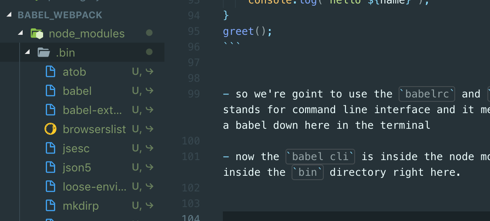

→ `node_modules/.bin/babel before.js -o after.js `

- inside after.js

```js
"use strict";

var greet = function greet(name) {
  console.log("hello ".concat(name));
};
greet();
```


### `node_modules`

- This is where all of the third party package code lives, so if we install a package it lives inside this `node modules` folder

- If I was to ever send my project to another developer or upload it to github then I wouldn't send or 
  upload this node modules folder every other file or folder I would send or upload 
  but not the node modules because it's so huge it contains a lot of code in it. 

- So if I don't send or upload this folder(node_modules) with my project how will another developer run this project correctly without that folder. 

- well, they can't They need to get that folder back and reinstall all of those things. But that's simple thanks to our `package.json` file down here

- Remember the `package.json` file keeps track of all the packages that we install for this project. 

- So when a developer gets this project without the `node_modules` folder 
  they can still see inside the `package.json` file what packages need to be installed right here. 

- Now they don't have to install each one individually they can do them altogether 
  by just using one command. And that is `npm install` and 
  this reinstall is all the packages inside `package.json` and create a known modules folder for them to get. 

---
- Remember: If you were to download the files from github repository then 
  you won't see the `node_modules` folder, and you would have to run `npm install` to 
  install all of these packages right there and that will create the `node_modules` folder for you.

### `NPM Script & Watching Files`

- we create all required folders and files

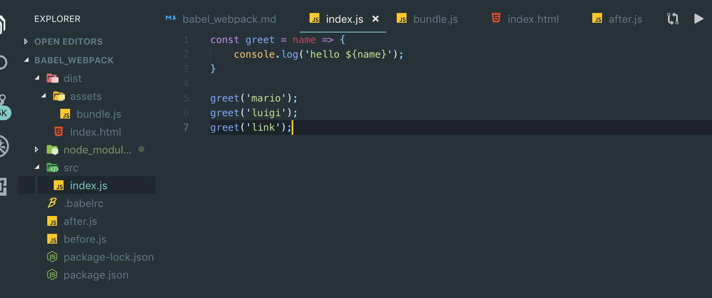


- now we convert the older code to the new .js file

→ `node_modules/.bin/babel src/index.js -o dist/assets/bundle.js`

```js
//index.js
const greet = name => {
    console.log(`hello ${name}`);
}

greet('mario');
greet('luigi');
greet('link');
```

```js
//bundle.js
"use strict";

var greet = function greet(name) {
  console.log("hello ".concat(name));
};

greet('mario');
greet('luigi');
greet('link');
```

- but the problem is that there is a lot to write every time we want to do this conversion 
  because we might make changes to this code several times and we have to write this out every time. 

- so I'm goint to copy the command line instruction, and we're going to go over to `package.json`,
   and you'll notice we have this script section in package.

`package.json`

```js
{
  "name": "babel_webpack",
  "version": "1.0.0",
  "description": "",
  "main": "index.js",
  "scripts": {
    "babel": "node_modules/.bin/babel src/index.js -o dist/assets/bundle.js"
  },
  "author": "",
  "license": "ISC",
  "dependencies": {
    "@babel/cli": "^7.5.5",
    "@babel/core": "^7.5.5"
  },
  "devDependencies": {
    "@babel/preset-env": "^7.5.5"
  }
}
```

- so we altering the babel

`"babel": "node_modules/.bin/babel src/index.js -o dist/assets/bundle.js"`

- now we can run `npm run babel`

```js
→ npm run babel                                                                                         [c0c5373]

> babel_webpack@1.0.0 babel /Users/Git/gitJsSyntax/babel_webpack
> babel src/index.js -o dist/assets/bundle.js
```

- now we have altered the `bundle.js`'s content

- `watch flag`, inside package.json:

`"babel": "node_modules/.bin/babel src/index.js -w -o dist/assets/bundle.js"`

- now after we alter .js file, we just need to save the .js file. It will automactially change the codes

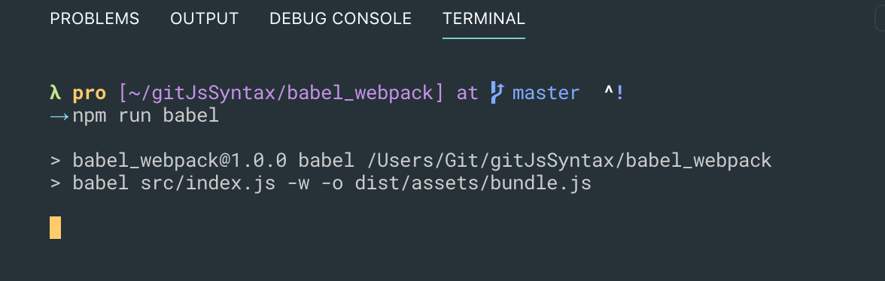


### `Webpack`

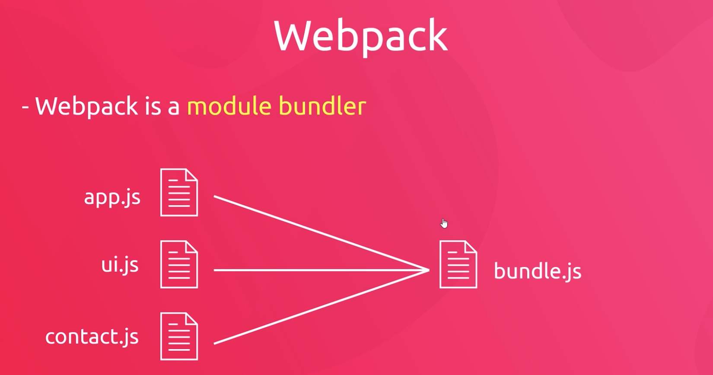

- Webpack is a `module bundler`

- Works well with `babel`

- Local development server


### `setting up a Webpack file`

- create a `webpack.config.js`

- now this is not javascript that can run normally in a browser

- it's javascript that can only run directly on a computer with the help of node.js

- it's going to be running in the computer to compile all our code together bundle it all together 
  and spit out this bundle and this bundle is ultimately the only thing that is going to be running inside a browser

`webpack.config.js`

```js
module.exports = {};
```

- so module exports basically means that we're going to export a Webpack configuration object right here

- inside this object we need to specify two main properties:
    
    1. we need to set an `entry` property 
    
    2. `output` property

`webpack.config.js`

```js
const path = require('path');

module.exports = {
    entry: './src/index.js',
    output: {
        path: path.resolve(__dirname, 'dist/assets'),
        filename: 'bundle.js'
    }
};
```


### `Webpack CLI`

→ `npm install webpack webpack-cli --save-dev`

- we have installed webpack 

run:

→`node_modules/.bin/webpack`

- updating package.json:

```js
{
  "name": "babel_webpack",
  "version": "1.0.0",
  "description": "",
  "main": "index.js",
  "scripts": {
    "babel": "node_modules/.bin/babel src/index.js -w -o dist/assets/bundle.js",
    "webpack": "node_modules/.bin/webpack"
  },
  "author": "",
  "license": "ISC",
  "dependencies": {
    "@babel/cli": "^7.5.5",
    "@babel/core": "^7.5.5"
  },
  "devDependencies": {
    "@babel/preset-env": "^7.5.5",
    "webpack": "^4.39.1",
    "webpack-cli": "^3.3.6"
  }
}
```

→ `npm run webpack`

```js
→ npm run webpack                                                                                   [dcf7440]

> babel_webpack@1.0.0 webpack /Users/Git/gitJsSyntax/babel_webpack
> webpack
```

`bundle.js`  

```js
!function(e){var t={};function n(r){if(t[r])return t[r].exports;var o=t[r]={i:r,l:!1,exports:{}};return e[r].call(o.exports,o,o.exports,n),o.l=!0,o.exports}n.m=e,n.c=t,n.d=function(e,t,r){n.o(e,t)||Object.defineProperty(e,t,{enumerable:!0,get:r})},n.r=function(e){"undefined"!=typeof Symbol&&Symbol.toStringTag&&Object.defineProperty(e,Symbol.toStringTag,{value:"Module"}),Object.defineProperty(e,"__esModule",{value:!0})},n.t=function(e,t){if(1&t&&(e=n(e)),8&t)return e;if(4&t&&"object"==typeof e&&e&&e.__esModule)return e;var r=Object.create(null);if(n.r(r),Object.defineProperty(r,"default",{enumerable:!0,value:e}),2&t&&"string"!=typeof e)for(var o in e)n.d(r,o,function(t){return e[t]}.bind(null,o));return r},n.n=function(e){var t=e&&e.__esModule?function(){return e.default}:function(){return e};return n.d(t,"a",t),t},n.o=function(e,t){return Object.prototype.hasOwnProperty.call(e,t)},n.p="",n(n.s=0)}([function(e,t){const n=e=>{console.log(`hello ${e}`)};n("mario"),n("luigi"),n("link"),n("link")}]);
```

### Introduction to Modules`

- we temporarily clear `index.js`'s content

- create a `dom.js`

```js
console.log('dom file');

const body = document.querySelector('body');

const styleBody = () => {
    body.style.background = 'peachpuff';
};

const addTitle = (text) => {
    const title = document.createElement('h1');
    title.textContent = text;
    body.appendChild(title)

};
styleBody();
addTitle('hello, world from the dom file');

```

`index.js`

```js
//Introduction to Modules
import './dom';

console.log('index file');
```
- run `npm run webpack`

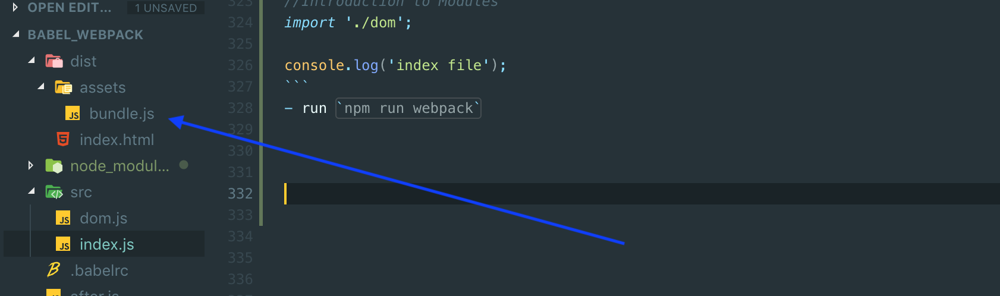
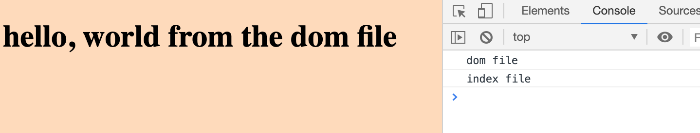

- what if we call the `addTitle()` from `dom.js` 

- run → `npm run webpack`  

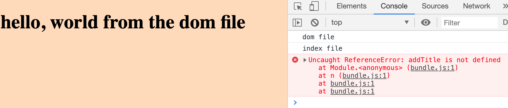

- we can see that there is an error: `addTitle` is not defined 

- so when we use modules to `import` a file like this it runs the code inside that file 
  but it doesn't automatically share any variables or functions with the file that import it. 

- we couldn't automactically access any of the variables or function that we define inside the Dom file

- so in order for this to work we have to manually export functions that we want to use inside index from this file.

- well we can do that by putting an export keyword in front of the things we want to export. 

`dom.js`

```js
//Modules  
console.log('dom file');

const body = document.querySelector('body');

export const styleBody = () => {
    body.style.background = 'peachpuff';
};

export const addTitle = (text) => {
    const title = document.createElement('h1');
    title.textContent = text;
    body.appendChild(title)

};
styleBody();
addTitle('hello, world from the dom file');

```

- now if I save it if I come over here we have to explicitly import those things from this file as well. 

- so inside index.js

```js
import { styleBody, addTitle } from './dom';

console.log('index file');
addTitle('test')
styleBody();
```

`updating dom.js`

```js
//Modules  
console.log('dom file');

const body = document.querySelector('body');

export const styleBody = () => {
    body.style.background = 'peachpuff';
};

export const addTitle = (text) => {
    const title = document.createElement('h1');
    title.textContent = text;
    body.appendChild(title)

};
```

- so now if I `npm run webpack` again

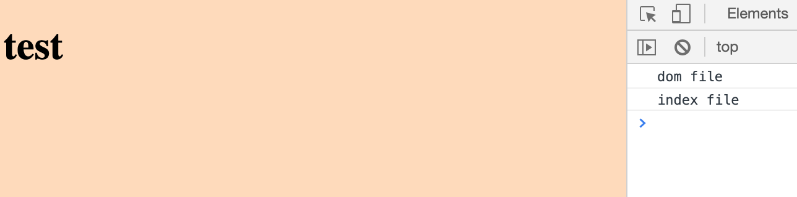

- now we have added a titile "test"

- now we can export more than just functions from a file we can export any kind of data like arrays object strings classes


- let's now try exporting a string:

```js
//Modules  
console.log('dom file');

const body = document.querySelector('body');

export const styleBody = () => {
    body.style.background = 'peachpuff';
};

export const addTitle = (text) => {
    const title = document.createElement('h1');
    title.textContent = text;
    body.appendChild(title)
};
export const contact = 'mario@thenetninja.co.uk';
```

```js

import { styleBody, addTitle, contact } from './dom';
console.log('index file');
addTitle('test')
styleBody();
console.log(contact);
```

→ `npm run webpack`  


```js
//Deafult exports
console.log('dom file');

const body = document.querySelector('body');

const styleBody = () => {
    body.style.background = 'peachpuff';
};

const addTitle = (text) => {
    const title = document.createElement('h1');
    title.textContent = text;
    body.appendChild(title)
};
const contact = 'mario@thenetninja.co.uk';

export { styleBody, addTitle, contact }
```

→ `npm run webpack`  

- then, the result is the same


### `default exports`

- create a `data.js` inside src folder

```js
const users = [
    { name: 'mario', premium: true },
    { name: 'luigi', premium: false },
    { name: 'yoshi', premium: true },
    { name: 'toad', premium: true },
    { name: 'peach', premium: false }
];
```

- imagine now I want to export this thing from this file. 

- Now previously when we've been exporting things we've been exporting multiple different things.

- we'd make something a default export

```js
//Default Exports
import { styleBody, addTitle, contact } from './dom';
import users from './data';

console.log(users);
```


- updating data.js

```js
const users = [
    { name: 'mario', premium: true },
    { name: 'luigi', premium: false },
    { name: 'yoshi', premium: true },
    { name: 'toad', premium: true },
    { name: 'peach', premium: false }
];

export const getPremUser = (users) => {
    return users.filter(users => users.premium);
}

export default users;
```

`dom.js`

```js
//Deafult exports
console.log('dom file');

const body = document.querySelector('body');

const styleBody = () => {
    body.style.background = 'peachpuff';
};

const addTitle = (text) => {
    const title = document.createElement('h1');
    title.textContent = text;
    body.appendChild(title)
};
const contact = 'mario@thenetninja.co.uk';

export { styleBody, addTitle, contact }
```

`index.js`

```js
//Default Exports
import { styleBody, addTitle, contact } from './dom';
import users, { getPremUser } from './data';

const premUsers = getPremUser(users);
console.log(users, premUsers);
```

→ `npm run webpack`  

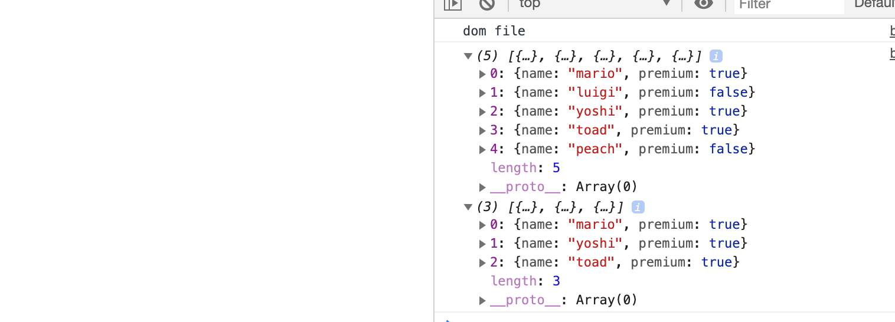


- Now let's have a look at the alternative way of exporting and things where we define it all at the bottom.

`altering data.js`

```js
const users = [
    { name: 'mario', premium: true },
    { name: 'luigi', premium: false },
    { name: 'yoshi', premium: true },
    { name: 'toad', premium: true },
    { name: 'peach', premium: false }
];

const getPremUser = (users) => {
    return users.filter(users => users.premium);
}

export { getPremUser, users as default }
```

- the same output


### `Watching for Changes`

- now we can use modules inside our project which is going to really help us to structure our code a bit better in the future.

- There's a small problem every time we make a change to a file inside our source folder 
  at the minute we have to rerun the webpack command to rebound all the javascript. 

- It would be nice if we could instead have webpack automatically rerun every time 
  we make a change to a file and save it much like we did with babel before and we can do this. 

- All we need to do is come to package.json and where we have our web script come to the end.

`alter package.json`

```js
{
  "name": "babel_webpack",
  "version": "1.0.0",
  "description": "",
  "main": "index.js",
  "scripts": {
    "babel": "node_modules/.bin/babel src/index.js -w -o dist/assets/bundle.js",
    "webpack": "node_modules/.bin/webpack -w"
  },
  "author": "",
  "license": "ISC",
  "dependencies": {
    "@babel/cli": "^7.5.5",
    "@babel/core": "^7.5.5"
  },
  "devDependencies": {
    "@babel/preset-env": "^7.5.5",
    "webpack": "^4.39.1",
    "webpack-cli": "^3.3.6"
  }
}
```

- now we run

```js
→ npm run webpack                                                                               

> babel_webpack@1.0.0 webpack /Users/Git/gitJsSyntax/babel_webpack
> webpack -w
```

- now we optionally adding a statement into index.js

```js
console.log('test');
```

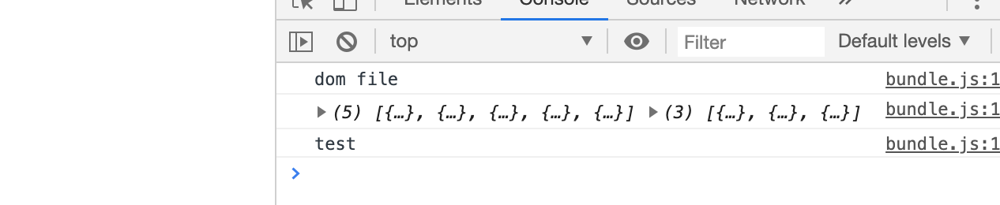

- if you want to cancel this

`control + c` on terminal


### `Webpack Dev Server`

→ `npm install webpack-dev-server@3.2.1`

- next step, we need to do is configure that webpack dev server inside the webpack.config.js

- to do that, we need another property, which is called `dev server` like so and this is an object. 

`webpack.config.js`

```js
const path = require('path');

module.exports = {
    entry: './src/index.js',
    output: {
        path: path.resolve(__dirname, 'dist/assets'),
        filename: 'bundle.js'
    },
    devServer: {
        contentBase: path.resolve(__dirname, 'dist'),
        publicPath: '/assets/'
    }
};
```

`package.json`

```js
{
  "name": "babel_webpack",
  "version": "1.0.0",
  "description": "",
  "main": "index.js",
  "scripts": {
    "babel": "node_modules/.bin/babel src/index.js -w -o dist/assets/bundle.js",
    "webpack": "node_modules/.bin/webpack -w",
    "serve": "webpack-dev-server"
  },
```

- sometimes we need to update `webpack-dev-server`

- run this instruction:

→ `npm install webpack-dev-server`

-  and it will update itself to the newest version and it should work just fine

### now, we clear `bundle.js`'s content

- go to index.js, say test 3

- if we go back to `bundle.js`, we still see nothing. All it's done is created a virtual file which is erving up from this path.

- we can still see the same results and we can still see all of this logged to the console 
  because it's serving that virtual file that virtual javascript file but we don't see it inside `bundle.js`, there is no physical manifestation of it.

- Now this is great for development because it speeds things up for us every time we make a save.


### `Production & Development Modes`

- take off the `-w` file because we're only typically going to build this once when we want to build

- we don't need to watch files anymore and rerun this when we're making changes because tthat's what the development script is for.

`altering package.json`

```js
{
  "name": "babel_webpack",
  "version": "1.0.0",
  "description": "",
  "main": "index.js",
  "scripts": {
    "build": "node_modules/.bin/webpack",
    "serve": "webpack-dev-server"
  },
  "author": "",
  "license": "ISC",
  "dependencies": {
    "@babel/cli": "^7.5.5",
    "@babel/core": "^7.5.5",
    "webpack-dev-server": "^3.7.2"
  },
  "devDependencies": {
    "@babel/preset-env": "^7.5.5",
    "webpack": "^4.39.1",
    "webpack-cli": "^3.3.6"
  }
}
```

→ `npm run build` 

- now we can see the `bundle.js`'s content:

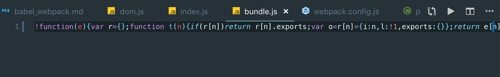
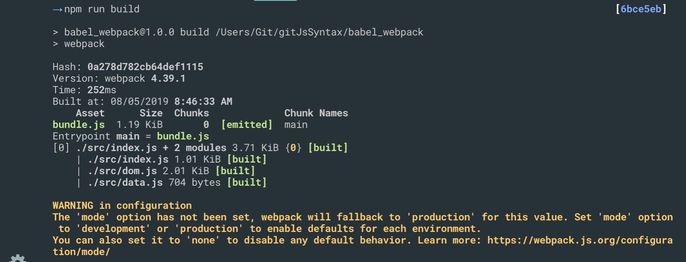

- the problem is that we see the yellow warning

`altering package.json`

```js
  "scripts": {
    "build": "node_modules/.bin/webpack --mode production",
    "serve": "webpack-dev-server --mode development"
  },
```


- we don't get that big yellow warning anymore.


### `Babel & Webpack Together`

→ `npm install babel-loader --save -dev`


- we're going to create a module property 

- regular expression:

```js
rules: [{
    test: /\.js$/
}]
//this regualr expression is testing for any file that ends in .js
// $ means the end
// dot(.) means any character by default
// " \.js$ " this whole expression means look for files which end in .js and that's what we want to run through the babel loader


    module: {
        rules: [{
            test: /\.js$/,
            exclude: /node_modules/
        }]
    }
//imagine we import some kind of package from node modules then we don't want to run that through the babel loader because that's code that someone else has written that we've just installed 
//so we don't want to do any additional processing on their code. We just want to do it on our code.      
//we don't want to run anything from there through the babel loader

//updating
    module: {
        rules: [{
            test: /\.js$/,
            exclude: /node_modules/,
            use: {
                loader: 'babel-loader',
                options: {
                    presets: ['@babel/preset-env']
                }
            }
        }]
    }
// now we're looking for any .js file that's not coming from node_modules,   
```


### `Webpack Boilerplate`

- Now you might be thinking that this is an awful lot of work to do every time you create a new project which uses javascript.

- First of all we don't always have to use web for every single one of our projects.

- secondly when we do use this workflow and we do use Webpack we're not going to need to rewrite our whole configuration and our whole project structure from scratch. 

- Typically what I do is create a boilerplate(样板) web project

- Then I upload that to Github once then whenever I want to create a new project

- What I do is go to download that boilerplate and get up or running right away with that boilerplate. 

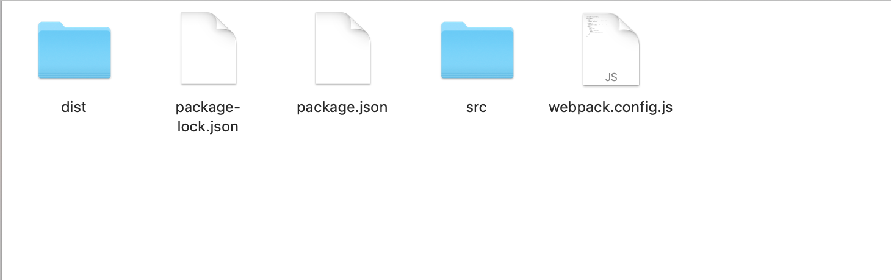
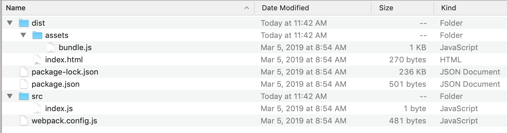

- so now everything is setting up ready for us, however, we don't see a `node_modules` folder over here and we do need those package listed package.json

- Remember: we don't have to install each one of these manually

- we just need to type 

`npm install`

- then the only we need to run

`npm run serve`

- finally, we can rewrite `index.js`

- we can test our project by overwrite index.js to check! 


