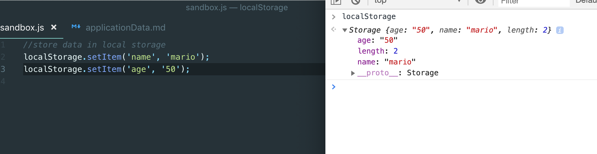
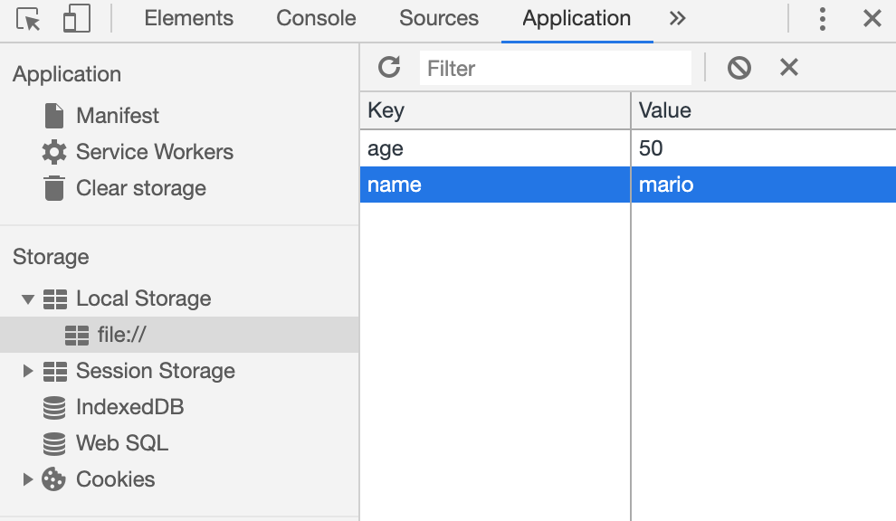
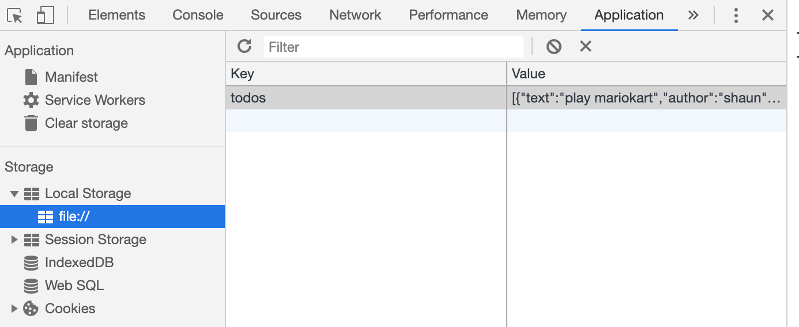

# 2. local storage

### `What is Local Storage?`

- Set up a database to store & retrieve data

- Use local storage to store and retrieve data
  
- Remember: `local Storage` is on the `Window` object so we could print out window the local storage





```js
//store data in local storage
localStorage.setItem('name', 'mario');
localStorage.setItem('age', '50');


//get data from local storage
let name = localStorage.getItem('name')
let age = localStorage.getItem('age')
console.log(name, age);  //mario 50


//updating data
localStorage.setItem('name', 'luigi');
localStorage.age = '40'

name = localStorage.getItem('name');
age = localStorage.getItem('age')
console.log(name, age);//luigi 40
```


### delete data from local storage

```js

//store data in local storage
localStorage.setItem('name', 'mario');
localStorage.setItem('age', '50');


//get data from local storage
let name = localStorage.getItem('name')
let age = localStorage.getItem('age')
console.log(name, age);


//deleting data from local storage
// localStorage.removeItem('name');
localStorage.clear();
name = localStorage.getItem('name');
age = localStorage.getItem('age');
console.log(name, age)
//output: null, null

```


### Stringifying & Parsing Data 

```js
const todos = [
    { text: 'play mariokart', author: 'shaun' },
    { text: 'buy some milk', author: 'mario' },
    { text: 'buy some bread', author: 'luigi' }
];


// console.log(JSON.stringify(todos))
localStorage.setItem('todos', JSON.stringify(todos))
```


- print to  `JSON` data format

```js
const stored = localStorage.getItem('todos')

console.log(stored);    

//output:
[
    {"text":"play mariokart","author":"shaun"},
    {"text":"buy some milk","author":"mario"},
    {"text":"buy some bread","author":"luigi"}
]
```

```js
console.log(JSON.parse(stored));

//output

    { text: 'play mariokart', author: 'shaun' }
    { text: 'buy some milk', author: 'mario' }
    { text: 'buy some bread', author: 'luigi' }
```

