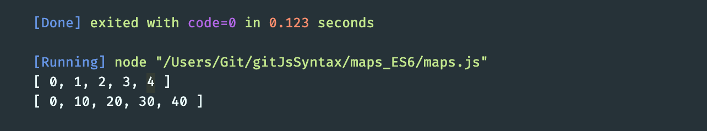

# 1. maps


```js
//Data Structure: Maps

const question = new Map();
question.set('question', 'What is the official name of the lateste major JavaScript version?');
question.set(1, 'ES5')
question.set(2, 'ES6')
question.set(3, 'ES2015')
question.set(4, 'ES7')
question.set('correct', 3);
question.set(true, 'Correct answer:D');
question.set(false, 'Wrong, please try again!');
/* input: question
0: {"question" => "What is the official name of the lateste major JavaScript version?"}
1: {1 => "ES5"}
2: {2 => "ES6"}
3: {3 => "ES2015"}
4: {4 => "ES7"}
5: {"correct" => 3}
6: {true => "Correct answer:D"}
7: {false => "Wrong, please try again!"}

*/

console.log(question.get('question'));//What is the official name of the lateste major JavaScript version?
console.log(question.size) //8

if(question.has(4)){
    //question.delete(4)
    console.log('Answer 4 is here.')
}
//question.clear();


question.forEach((value, key) => 
    console.log(`This is ${key}, and it's set to ${value}`)
);
/* 
This is question, and it's set to What is the official name of the lateste major JavaScript version?
This is 1, and it's set to ES5
This is 2, and it's set to ES6
This is 3, and it's set to ES2015
This is 4, and it's set to ES7
This is correct, and it's set to 3
This is true, and it's set to Correct answer:D
This is false, and it's set to Wrong, please try again!
*/

for(let [key, value] of question.entries()){
    console.log(`This is ${key}, and it's set to ${value}`);
}/* same result like the previous results */
```

---
---

- map.js

```js
const numbers = [0, 1, 2, 3, 4];

let newNumbers = [];

for (let i = 0; i < numbers.length; i++) {
    newNumbers.push(numbers[i] * 10);
}

console.log(numbers);
console.log(newNumbers);
```


