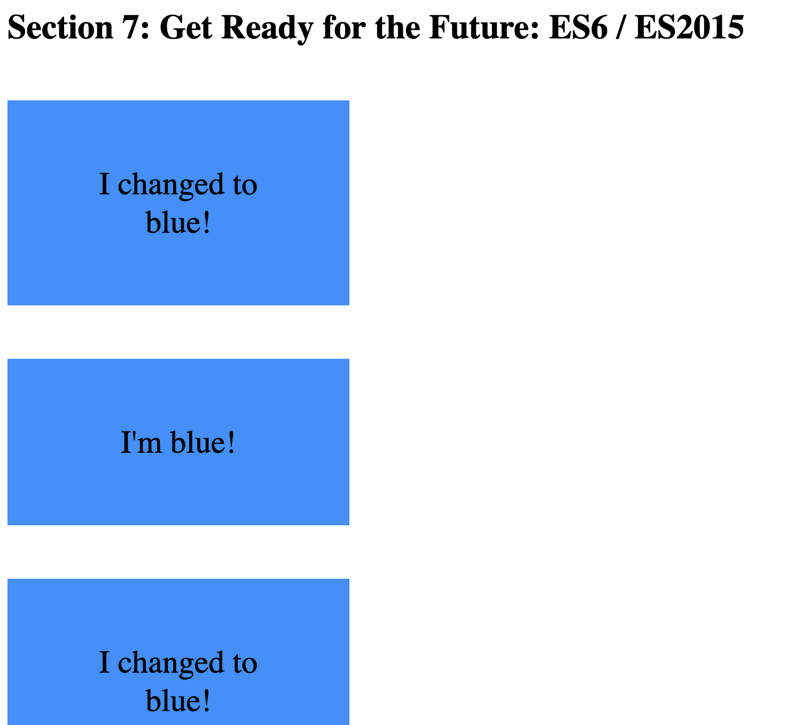
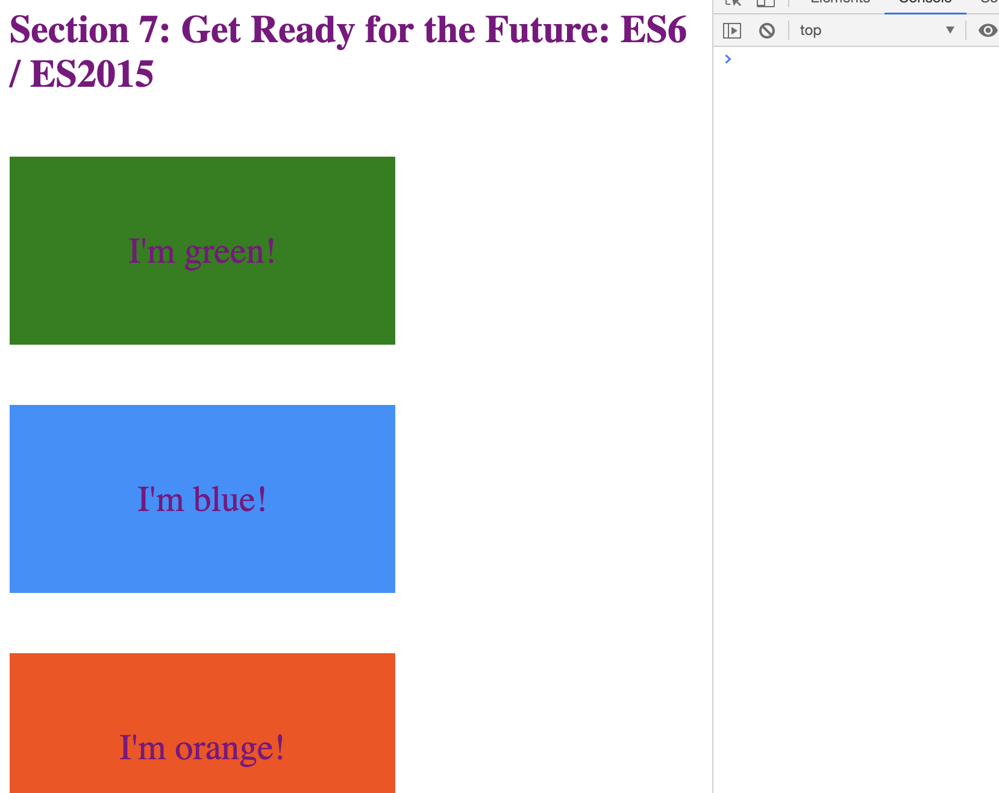

# 3. Array ES6

### `ES5`

`index.html`

```html
<html lang="en">
    <head>
        <title>Section 7: Get Ready for the Future: ES6 / ES2015</title>
        <style>
            .box {
                width: 200px;
                padding: 60px;
                text-align: center;
                font-size: 30px;
                margin-top: 50px;
            }         
            .green { background-color: green; }
            .blue { background-color: dodgerblue; }
            .orange { background-color: orangered; }
        </style>
        
    </head>
    <body>
        <h1>Section 7: Get Ready for the Future: ES6 / ES2015</h1>
        <div class="box green">I'm green!</div>
        <div class="box blue">I'm blue!</div>
        <div class="box orange">I'm orange!</div>
        
        <script src="script.js"></script>
    </body>
</html>
```


```js
const boxes = document.querySelectorAll('.box');

//ES5
var boxesArr5 = Array.prototype.slice.call(boxes);
boxesArr5.forEach(function(cur){
    cur.style.backgroundColor = 'dodgerblue';
});
```


### `ES6`

```js
const boxesArr6 = Array.from(boxes);
boxesArr6.forEach(cur => cur.style.backgroundColor = 'dodgerblue');
```

- Or: (combine two statement)

```js
Array.from(boxes).forEach(cur => cur.style.backgroundColor = 'dodgerblue');
```

### `ES5`

```js
for(var i=0; i<boxesArr5.length; i++){
    if(boxesArr5[i].className === 'box blue'){
        continue;
    }
    boxesArr5[i].textContent = 'I changed to blue!';
}
```



# The same result of ES6:

```js
//ES6
for(const cur of boxesArr6){
    if(cur.className.includes('blue')){
        continue;
    }
    cur.textContent = 'I changed to blue';
}
```

### `ES5 map && ES6`

```js
//ES5   
var ages = [12, 17, 8, 21, 14, 11];

var fullAge = ages.map(function(cur){
    return cur >= 18;
});
console.log(fullAge); //[false, false, false, true, false, false]
console.log(fullAge.indexOf(true)); //3
console.log(ages[fullAge.indexOf(true)]); //21

//ES6
console.log(ages.findIndex(cur => cur >= 18));  //3
console.log(ages.find(cur => cur>= 18)); //21
```


### `Spread Operator`

```js
function addFourAges (a, b, c, d){
    return a + b + c + d;
}
var sum1 = addFourAges(18, 30,12, 21);
console.log(sum1);//81

//ES5
var ages =[18, 30, 12, 21];
var sum2 = addFourAges.apply(null, ages);
console.log(sum2);//81

//ES6
const sum3 = addFourAges(...ages);
console.log(sum3);//81

const familySmith = ['John', 'Jane', 'Mark'];
const familyMiller = ['Mary', 'Bob', 'Ann'];
let bigFamily = [...familySmith, ...familyMiller];
console.log(bigFamily);//["John", "Jane", "Mark", "Mary", "Bob", "Ann"]
bigFamily = [...familySmith, 'Lily', ...familyMiller];
console.log(bigFamily);//["John", "Jane", "Mark", "Lily", "Mary", "Bob", "Ann"]
```

### `html implementation`

```html
<body>
        <h1>Section 7: Get Ready for the Future: ES6 / ES2015</h1>
        
        <div class="box green">I'm green!</div>
        <div class="box blue">I'm blue!</div>
        <div class="box orange">I'm orange!</div>
        
        <script src="script.js"></script>
</body>
```

```js
const h = document.querySelector('h1');
const boxes = document.querySelectorAll('.box');
const all = [h, ...boxes];
Array.from(all).forEach(cur => cur.style.color = 'purple');

//The same effect
const h = document.getElementsByTagName('h1')[0];
const boxes = document.getElementsByTagName('div');
const all = [h, ...boxes];
Array.from(all).forEach(cur => cur.style.color = 'purple');
```



