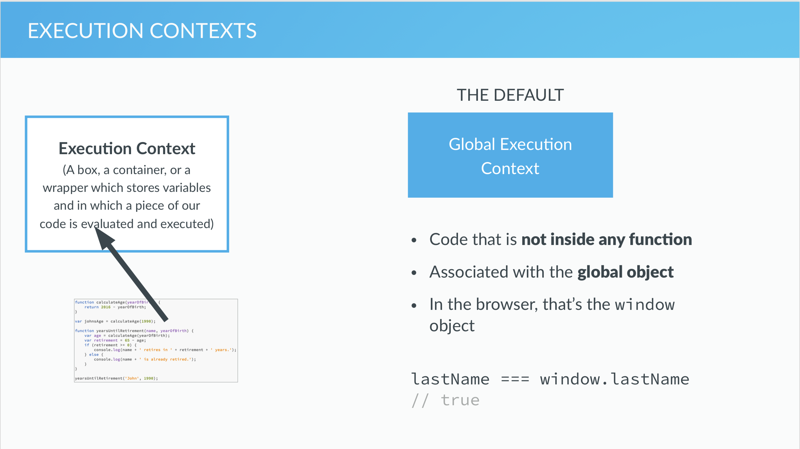
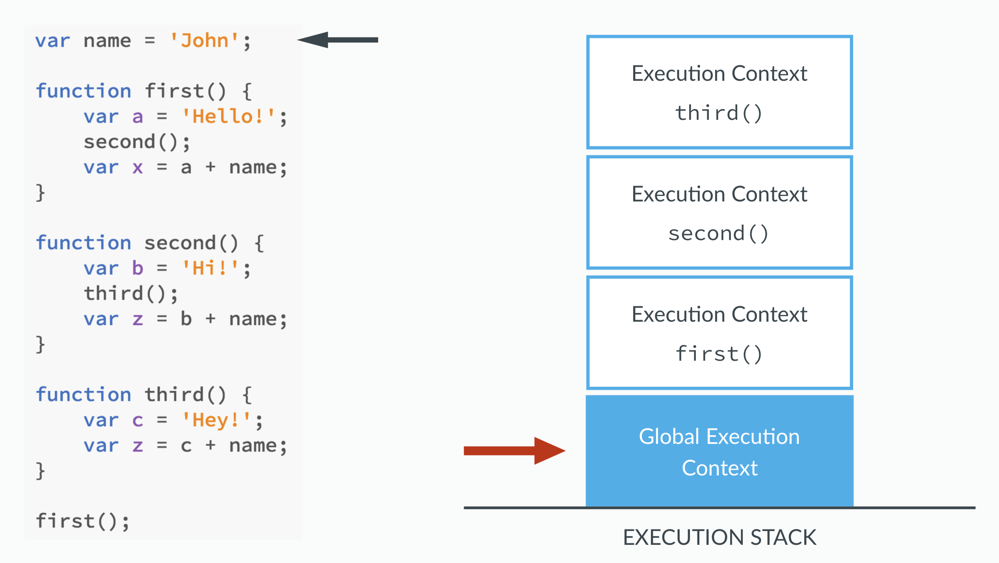
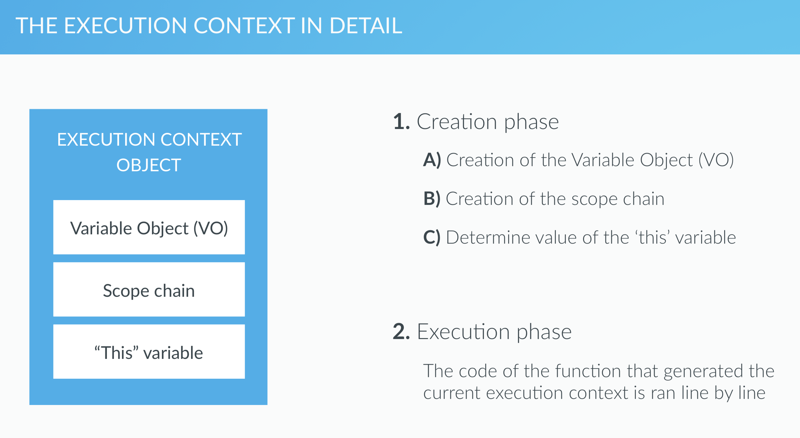
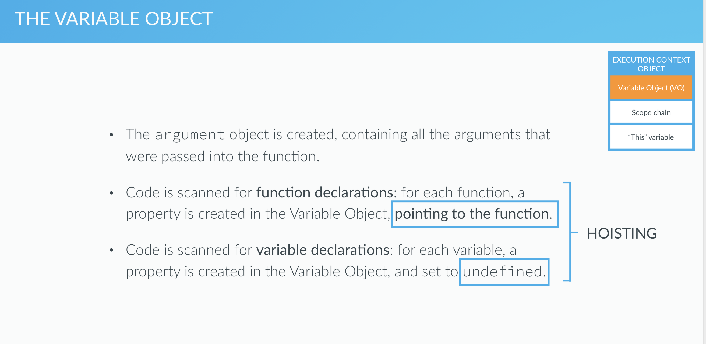

# 2. Execution Context Stack

# How javascript works behind the scenes






# Hoisting 

- **calculateAge which will work, since it is function declaration**

```js

calculateAge(1965); //54
function calculateAge(year){
    console.log(2019 - year);
}
```

- **the below, retirement(1956) not working, since retirement is not function declarations**

```js
retirement(1956); //not working
var retirement = function(year){
    console.log(65 - (2019 - year));
}
```