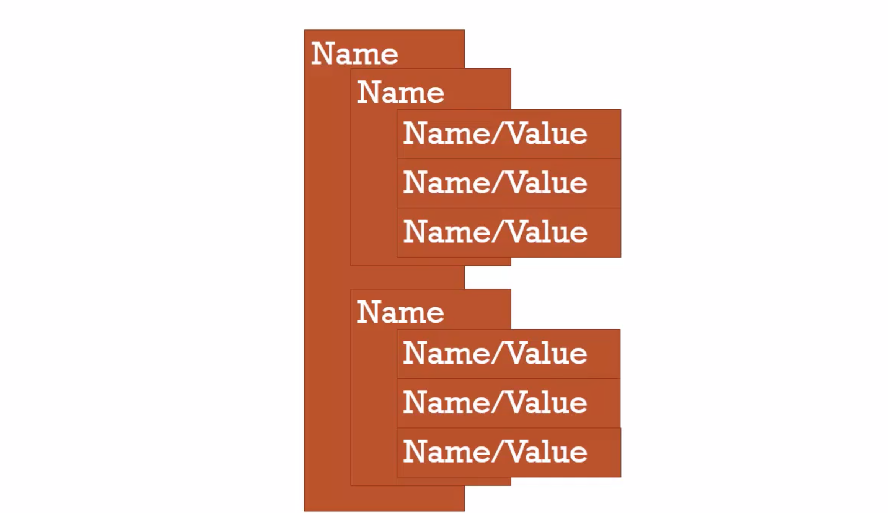

# 3. Name Value Pairs Object

# Name/Value pair



# Object:

- A collection of Name Value Pairs

```javascript
Address:
{
    Street: 'Main',
    Number: 100
    Apartment:
    {
        Floor: 3,
        Number: 301
    }
}
```

# Global Object


- enter this:


# When we say GLOBAL

- in javascript "Not Inside a Function"


```javascript
var a = 'Hello World!';
function b(){

}
```

```html
<html>
    <head>
    </head>
    <body>
        <script src="app.js"></script>
    </body>
</html>
```

- SINCE window = "this"

- Now, we can see:


