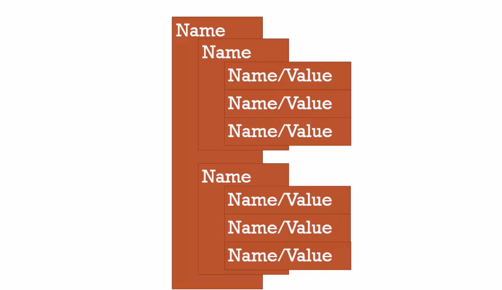

# 1. Object Properties

# Objects and Dot



### remember this picture

- Object can hava Primitive types, called Property

- An object could have another object connected to it as a child

- An object can also contains functions 

- Object hava properties and methods

```javascript
var person = new Object();

person["firstname"] = "Tony";
person["lastname"] = "Alicea";

var firstNameProperty = "firstname";

console.log(person)
console.log(person[firstNameProperty])

console.log(person.firstname);
console.log(person.lastname)

person.address = new Object();
person.address.street = "111 Main St.";
person.address.city = "New York";
person.address.state = "NY";

console.log(person.address.street)  //111 Main St.
console.log(person.address.city)    //New York
console.log(person["address"]["state"]) //NY
```

# Objects and properties

```js
var john = {
     firstName: 'John',
     lastName: 'Smith',
     birthYear: 1990,
     family: ['Jane', 'Mark', 'Bob', 'Emily'],
     job: 'teacher',
     isMarried: false
 };
 console.log(john.firstName);
 console.log(john['lastName']);
 var x = 'birthYear';
 console.log(john[x]);

 john.job = 'designer';
 john['isMarried'] = true;
 console.log(john);

 //new Object syntax
 var jane = new Object();
 jane.firstName = 'Jane';
 jane.birthYear = 1969;
 jane['lastname'] = 'Smith';
 console.log(jane);

```

---
# Objects and methods:

```js

var john = {
    firstName: 'John',
    lastName: 'Smith',
    birthYear: 1990,
    family: ['Jane', 'Mark', 'Bob', 'Emily'],
    job: 'teacher',
    isMarried: false,
    calcAge: function(birthYear){
        this.age = 2019 - birthYear;
    }
};

john.calcAge(1990);
console.log(john);

```

# Object property

```js
var a = {};
var b = new Object();     // equal to 'var a = {};'
//console.log(a);
console.log(a.constructor === b.constructor); //true 

//var a = Object.create(); 
//Error since you didn't pass any parameters into the prototype

var b = Object.create(
    {
        a: 1,
        b: 2
    }
);
console.log('b:', b);
```


