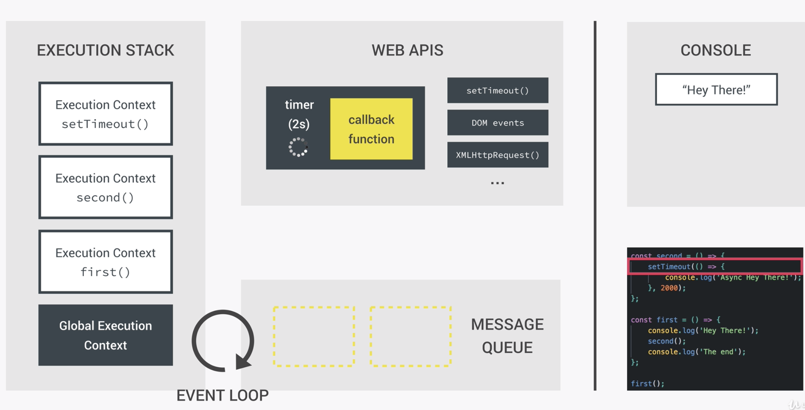
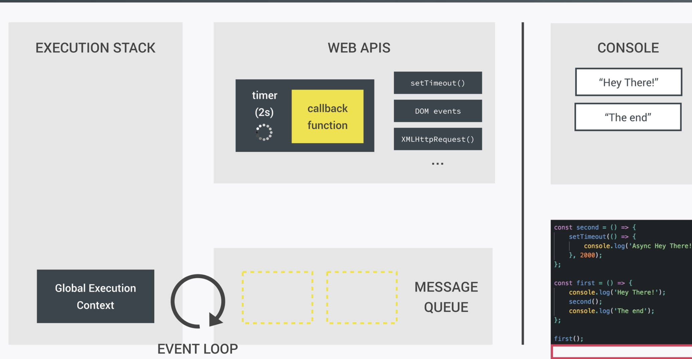
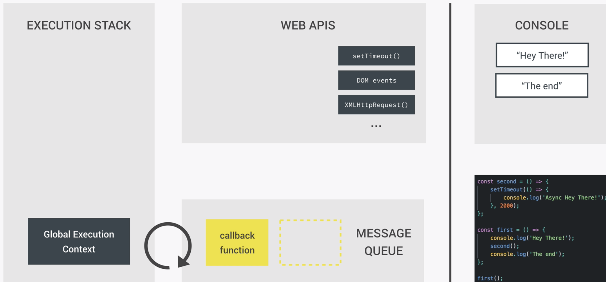
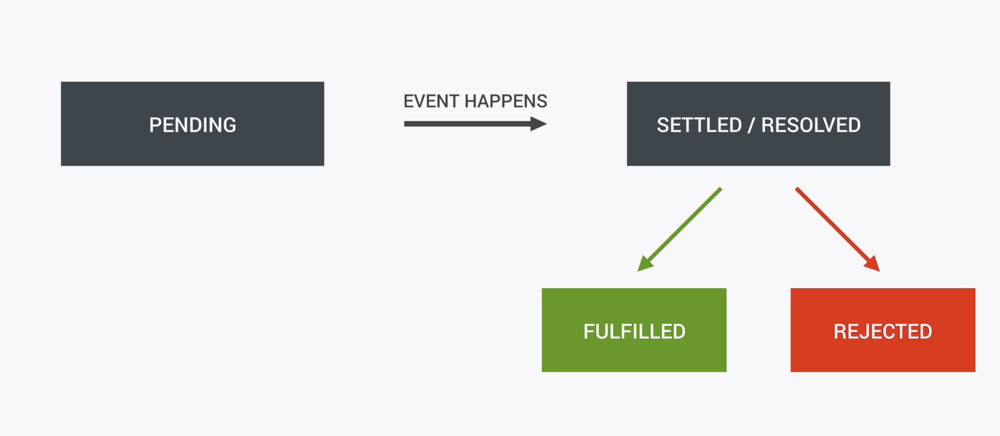

### `Synchronous`

```js
const second = () => {
        console.log('Async Hey there')
}

const first = () => {
    console.log('Hey there');
    second();
    console.log("The end");
}
first();

/*
Hey there
Async Hey there
The end
 */
```

### `Asynchonous`

```js
const second = () => {
    setTimeout(() => {
        console.log('Async Hey there')
    }, 2000);
}

const first = () => {
    console.log('Hey there');
    second();
    console.log("The end");
}
first();


/*
Hey there
The end
Async Hey there
*/


//One more example:
cosnt image = document.getElementById('img').scr;

processLargeImage(image, () => {
    console.log('Image processed!')
})
```


### Understanding Asynchronous: The Event Loop

- Allow asynchronous functions to run in the "background";

- We pass in callbacks that run once the function has finished its work;

- Move on immediately: Non-blocking!(非阻塞) 

### where does this setTimeout() function actually come from?

- It's part of something called the Web API

- which actually live outside the javaScript engine itself.

- Stuff like DOM manipulation methods, setTimeout, HTTP requests for AJAX, geolocation, 
  local storage ..., actually live outside of the javaScript engine.  

- we just access to them because they also in a javaScript runtime

- This is exactly where the timer will keep running for two seconds, asynchronously of course, 
  so that our code can keep running without being blocked. 

- so when we call the setTimeout(), the timer is created, together of course, 
  with our callback function right inside the Web API environment. 
  And there it keeps sitting until it finishes its work all in an Asychronous way. 



- Again, the callback function is not called right now, 
  but instead it says attached to the timer until it finishes. 

- And since the timer keeps working, basically in the background, 
  we don't have to wait, and keep executing our code.  

- Next up, the setTimeout() returns, pops off the stack and 
  so does the Execution Context of the second function which now returns as well

- and we are back to the initial first function. 

- now we just log `the end` to the console , and we give ourselves a new Execution Context, 
  print the text to the console and pop the text off agian. 

- Right now we have executed all our code in a Synchronous way, 
  and have the timer run Asynchronously in the background. 

- Now suppose that our two seconds have passed and the timer disappears. 




### `But what happens to our callback function now?`

- it simply moves to the Message Queue, where it waits to be executed as soon as 
  the Execution stack is empty. 



- so how are these callback functions in the Message Queue executed? finally, the Event loop comes in. 

- The job of the Event Loop is to constantly **monitor** the Message Queue and the Execution Stack, 
  and to push the first callback function in line onto the Execution Stack, as soon as the stack is empty. 

- In our example here, right now the stack is empty, and 
  we have one callback waiting to be executed. And the event loop takes the callback and pushes it onto the stack, 


  
- now look one more example

```js
const second = () => {
    setTimeout(() => {
        console.log('Async Hey there')
    }, 3000);
}

const another = () => {
    setTimeout(() => {
        console.log('Async another there')
    }, 2000);
}

const third = () => {
    console.log('third');
}
const forth = () => {
    console.log('forth');
}
const fifth = () => {
    console.log('fifth');
}
const sixth = () => {
    console.log('sixth');
}

const first = () => {
    console.log('Hey there');
    second();
    another();
    third();
    forth();
    fifth();
    sixth();
    console.log("The end");
}
first();

//output:
/* 
Hey there
third
forth
fifth
sixth
The end
Async another there
Async Hey there 
*/
```


### `The Old Way: Asynchronous javaScript with Callbacks`

```js
function getRecipe() {
    setTimeout(() => {
        const recipeID = [523, 883, 432, 974];
        console.log(recipeID);

        setTimeout((id) => {
            const recipe = { title: 'Fresh tomato pasta', publisher: 'Jonas' };
            console.log(`${id}: ${recipe.title}`);

            setTimeout(publisher => {
                const recipe2 = { title: 'Italian Piazza', publisher: 'Jonas' };
                console.log(recipe);
            }, 1500, recipe.publisher);

        }, 1500, recipeID[2]);

    }, 1500);
}
getRecipe();


        /* 
            [523, 883, 432, 974]
            432: Fresh tomato pasta
            {title: "Fresh tomato pasta", publisher: "Jonas"}
        */
```


### `From Callback Hell to Promises`

`Promise`

- Object that keeps track about whether a certain event has happened already or not;

- Determines what happens after the event has happened;

- Implements the concept of a future value that we're expecting




- testing resolve function

```js
        /* Passing two callback functions: resolve , reject
        that's because this executor function here is used to inform the promise
        whether the event it is handing was successful or not
        And if it was successful we're going to call the resolve function;
        if not we call the reject function
        */
const getIDS = new Promise((resolve, reject) => {
    setTimeout(() => {
        resolve([523, 883, 432, 974]);
        //since setTimeout function is alawys finished, we don't neet to call reject function

    }, 1500);
});

//Test handle then function
getIDS.then(IDs => {
    console.log(IDs);
}) //[523, 883, 432, 974]
    .catch(error => {
        console.log(error)
    });
    // It's impossible to fail, since setTimeout() always successs.
```


- testing reject function

```js
        const getIDS = new Promise((resolve, reject) => {
            setTimeout(() => {
                reject([523, 883, 432, 974]);
                //since setTimeout function is alawys finished, we don't neet to call reject function

            }, 1500);
        });

        getIDS
        .then(IDs => {
            console.log(IDs);
        })
        /* 
Uncaught (in promise) 
[523, 883, 432, 974]
Promise.then (async)		
(anonymous)
        */

       //if we add a catch function here, wen can get the error
        .catch(error => {
            console.log('Error!!');
        });
        //Error!
```

### example:

```js
        const getIDS = new Promise((resolve, reject) => {
            setTimeout(() => {
                resolve([523, 883, 432, 974]);
                //since setTimeout function is alawys finished, we don't neet to call reject function

            }, 1500);
        });

        const getRecipe = (recID) => {
            return new Promise((resolve, reject) => {
                setTimeout(ID => {
                    const recipe = {title: 'Fresh tomato pasta', publisher:'Jonas'};
                    console.log(`${ID}: ${recipe.title}`);
                }, 1500, recID);
            });
        };

        getIDS
        .then(IDs => {
            console.log(IDs);
            return getRecipe(IDs[2]);
        })
        .then(recipe => {
            console.log(recipe);
        })
        .catch(error => {
            console.log('Error!!');
        });

        /* 
        [523, 883, 432, 974]
        432: Fresh tomato pasta
        */
```


### example:

```js
const getIDS = new Promise((resolve, reject) => {
    setTimeout(() => {
        resolve([523, 883, 432, 974]);
        //since setTimeout function is alawys finished, we don't neet to call reject function

    }, 1500);
});

const getRecipe = (recID) => {
    return new Promise((resolve, reject) => {
        setTimeout(ID => {
            const recipe = { title: 'Fresh tomato pasta', publisher: 'Jonas' };
            resolve(`${ID}: ${recipe.title}`);
        }, 1500, recID);
    });
};

const getRelated = (publisher) => {
    return new Promise((resolve, reject) => {
        setTimeout((pub) => {
            const recipe = { title: 'Italian Piazza', publisher: 'Jonas' };
            resolve(`${pub}: ${recipe.title}`);
        }, 1500, publisher);
    });
}


getIDS
    .then(IDs => {
        console.log(IDs);
        return getRecipe(IDs[2]);
    })
    .then(recipe => {
        console.log(recipe);
        return getRelated('Jonas');
    })
    .then(recipe => {
        console.log(recipe);
    })
    .catch(error => {
        console.log('Error!!');
    });

/* 
[ 523, 883, 432, 974 ]
432: Fresh tomato pasta
Jonas: Italian Piazza
*/
```


### `Async/Await`

```
The async function declaration defines an asynchronous function, which returns an AsyncFunction object. An asynchronous function is a function which operates asynchronously via the event loop, using an implicit Promise to return its result. But the syntax and structure of your code using async functions is much more like using standard synchronous functions.
```

```js
//Async/Await
const getIDS = new Promise((resolve, reject) => {
    setTimeout(() => {
        resolve([523, 883, 432, 974]);
        //since setTimeout function is alawys finished, we don't neet to call reject function

    }, 1500);
});
const getRecipe = (recID) => {
    return new Promise((resolve, reject) => {
        setTimeout(ID => {
            const recipe = { title: 'Fresh tomato pasta', publisher: 'Jonas' };
            resolve(`${ID}: ${recipe.title}`);
        }, 1500, recID);
    });
};
const getRelated = (publisher) => {
    return new Promise((resolve, reject) => {
        setTimeout((pub) => {
            const recipe = { title: 'Italian Piazza', publisher: 'Jonas' };
            resolve(`${pub}: ${recipe.title}`);
        }, 1500, publisher);
    });
}

async function getRecipeAW() {
    const IDs = await getIDS;
    console.log(IDs);
    const recipe = await getRecipe(IDs[2]);
    console.log(recipe);
    const related = await getRelated('Jonas Schmedtamnn');
    console.log(related);
    
}

getRecipeAW();

/* 
[ 523, 883, 432, 974 ]
432: Fresh tomato pasta
Jonas Schmedtamnn: Italian Piazza
*/
```

### the last step is equal to:

```js
async function getRecipeAW() {
    const IDs = await getIDS;
    console.log(IDs);
    const recipe = await getRecipe(IDs[2]);
    console.log(recipe);
    const related = await getRelated('Jonas Schmedtamnn');
    console.log(related);

    return recipe;
}

getRecipeAW().then((result) => console.log(`${result} it the best ever!`));

/* 
[ 523, 883, 432, 974 ]
432: Fresh tomato pasta
Jonas Schmedtamnn: Italian Piazza
432: Fresh tomato pasta it the best ever!
*/
```


##  Ninja version

### `What are HTTP Requests ?`

- Make HTTP requests to get data from anohter server

- We make these request to API endpoints


### what is API ?

- `Application Programming Interface`

- APIs Make Life Easier for Developers

- APIs Control Access to Resources


### Now there's many different APIs that we can use to get data

- Twitter Youtube Instagram Spotify and loads more and 
  each API is going to have its own set of endpoints that we make request to for data.

- You could even make your own API using the service side language such as `Python` or 
  even `JavaScript` if you're using `Node.js`  

- Once we make a request to an endpoint from the browser 
  we typically `get back a selection of data in a format called JSON and Json is a format which looks very much like javascript objects`

### so the API that we're going to be using to practice with is:

[JSONPlaceholder API](https://jsonplaceholder.typicode.com/)

- this allows us to play around with API endpoints and to get back some JSON data 


### `HTTPRequst && Response Status`

```js
const getTodos = () => {
    const request = new XMLHttpRequest();

    request.addEventListener('readystatechange', () => {
        // console.log(request, request.readyState);
        if (request.readyState === 4 && request.status === 200) {
            console.log(request, request.responseText);
        } else if (request.readyState === 4) {
            console.log('could not fetch the data');
        }
    });

    request.open('GET', 'https://jsonplaceholder.typicode.com/todos');
    request.send();
}

getTodos();
```


### `callback function`

```js
const getTodos = (callback) => {
    const request = new XMLHttpRequest();

    request.addEventListener('readystatechange', () => {
        // console.log(request, request.readyState);
        if (request.readyState === 4 && request.status === 200) {
            callback(undefined, request.responseText);
        } else if (request.readyState === 4) {
            callback('could not fetch data', undefined);
        }
    });

    request.open('GET', 'https://jsonplaceholder.typicode.com/todos');
    request.send();
}


console.log(1)
console.log(2)
getTodos((error, data) => {
    console.log('callback is fired.');
    if (error) {
        console.log(error);
    } else {
        console.log(data);
    }
});
console.log(3)
console.log(4)


/* 
1
2
3
4
callback is fired.
[
  {
    "userId": 1,
    "id": 1,
    "title": "delectus aut autem",
    "completed": false
  },
    ...
        ...
            ...
*/
```


### `JSON data`

- what is JSON data?

```json
[
  {
    "userId": 1,
    "id": 1,
    "title": "delectus aut autem",
    "completed": false
  },
  {
    "userId": 1,
    "id": 2,
    "title": "quis ut nam facilis et officia qui",
    "completed": false
  },


// Remember my vscode setting.json data?
{
    "workbench.colorTheme": "Material Theme",
    "editor.minimap.enabled": false,
    "window.zoomLevel": 1,
    "terminal.integrated.fontSize": 13,
    // "terminal.integrated.fontFamily": "Meslo LG S DZ for Powerline",
    "terminal.integrated.fontFamily": "Roboto Mono for Powerline",
    "breadcrumbs.enabled": false,
    "[javascript]": {
        "editor.defaultFormatter": "vscode.typescript-language-features",
        "editor.formatOnType": true,
        "editor.formatOnSave": true
    },
    "workbench.iconTheme": "material-icon-theme"
}
```

- The `JSON.parse()` method parses a `JSON string`, 
  constructing the JavaScript value or object described by the string.

```js
const getTodos = (callback) => {
    const request = new XMLHttpRequest();

    request.addEventListener('readystatechange', () => {
        // console.log(request, request.readyState);
        if (request.readyState === 4 && request.status === 200) {
            const data = JSON.parse(request.responseText);
            callback(undefined, data);
        } else if (request.readyState === 4) {
            callback('could not fetch data', undefined);
        }
    });

    request.open('GET', 'https://jsonplaceholder.typicode.com/todos');
    request.send();
}


console.log(1)
console.log(2)
getTodos((error, data) => {
    console.log('callback is fired.');
    if (error) {
        console.log(error);
    } else {
        console.log(data);
    }
});
console.log(3)
console.log(4)
```


### `we can also create our JSON data as well`

`todos.json`

```json
[
    {"text": "play mariokart", "author": "shaun"},    
    {"text": "buy some bread", "author": "Mario"},    
    {"text": "do the plumming", "author": "Luigi"}    
]
```
```js
//create our JSON data
const getTodos = (callback) => {
    const request = new XMLHttpRequest();

    request.addEventListener('readystatechange', () => {
        if (request.readyState === 4 && request.status === 200) {
            const data = JSON.parse(request.responseText);
            callback(undefined, data);
        } else if (request.readyState === 4) {
            callback('could not fetch data', undefined);
        }
    });

    request.open('GET', 'todos.json');
    request.send();
}

getTodos((error, data) => {
    console.log('callback is fired.');
    if (error) {
        console.log(error);
    } else {
        console.log(data);
    }
});

```


