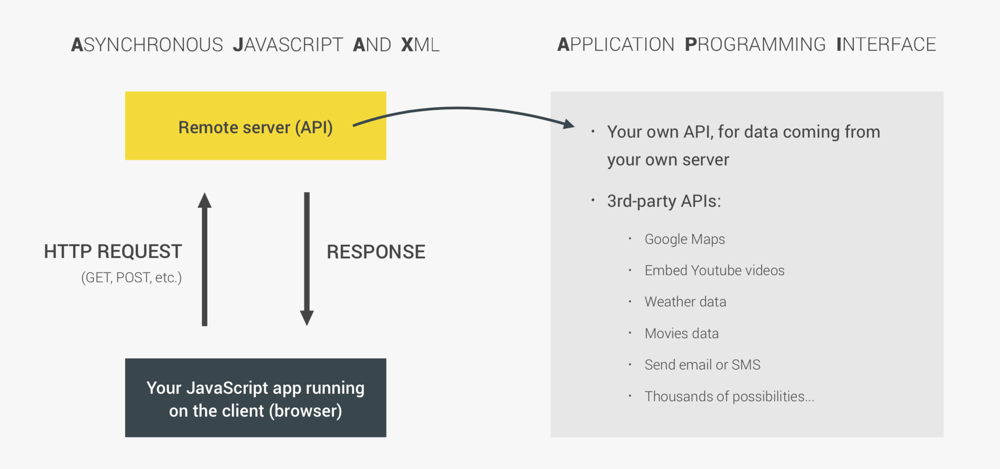
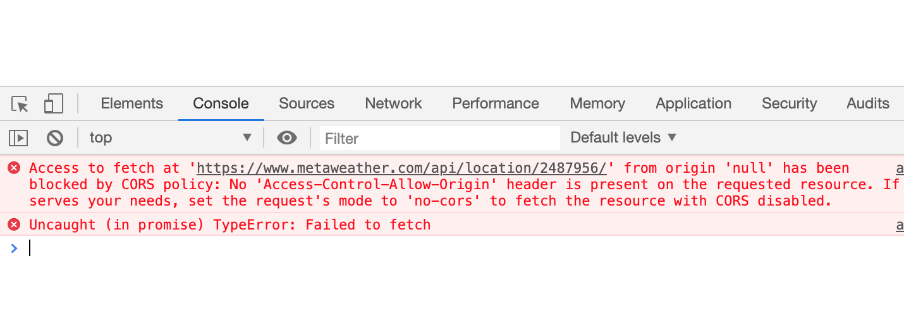
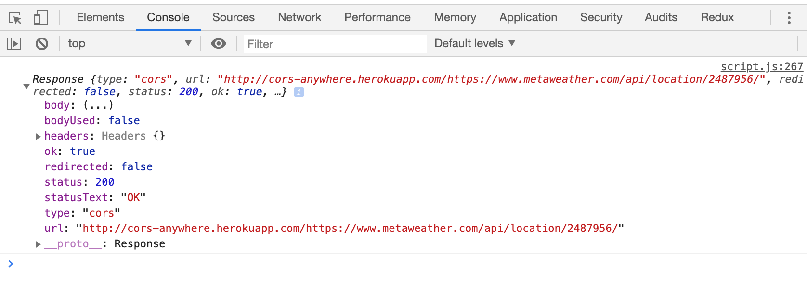
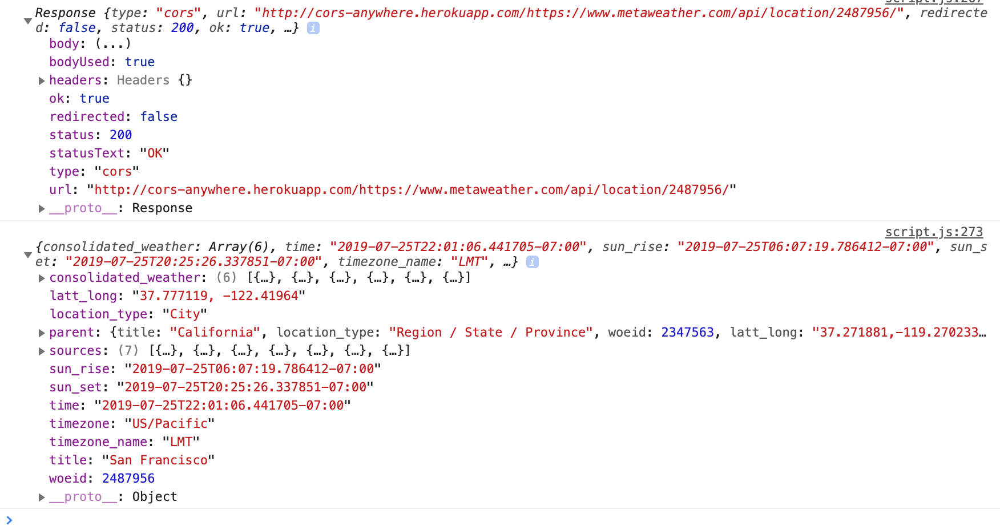
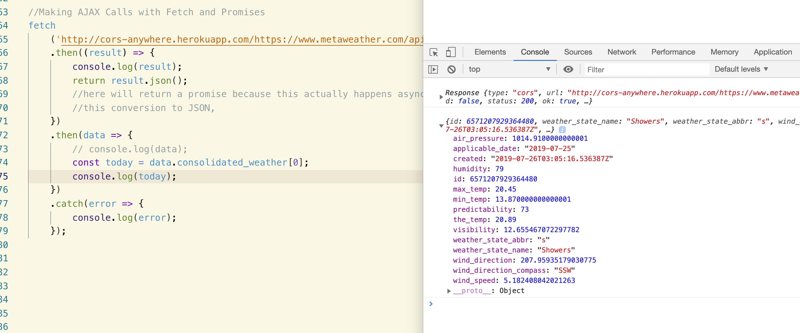
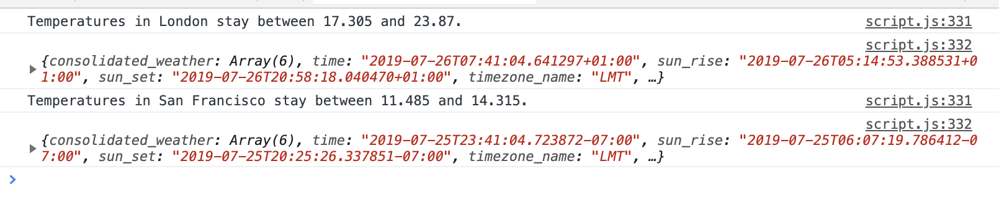

# 3. AJAX

### `AJAX and API`

- ASYNCHRONOUS JAVASCRIPT AND XML
  



- what is API ?

- `Application Programming Interface`

- APIs Make Life Easier for Developers

- APIs Control Access to Resources


- we first open a website: metaweather

[metaweather](https://www.metaweather.com/api/)

### `Making AJAX Calls with Fetch and Promises`

`fetch('https://www.metaweather.com/api/location/2487956/');`

- we will see a problem:



- but we can solve this issue:


`fetch('http://cors-anywhere.herokuapp.com/https://www.metaweather.com/api/location/2487956/');`

- Now there is no issue on the develop console

```js
fetch
    ('http://cors-anywhere.herokuapp.com/https://www.metaweather.com/api/location/2487956/')
    .then((result) => {
        console.log(result);
    })
    .catch(error => {
        console.log(error);
    });
```




```js
fetch
    ('http://cors-anywhere.herokuapp.com/https://www.metaweather.com/api/location/2487956/')
    .then((result) => {
        console.log(result);
        return result.json();
        //here will return a promise because this actually happens asynchronously,
        //this conversion to JSON, 
    })
    .then(data => {
        console.log(data);
    })
    .catch(error => {
        console.log(error);
    });
```



```js
fetch
    ('http://cors-anywhere.herokuapp.com/https://www.metaweather.com/api/location/2487956/')
    .then((result) => {
        console.log(result);
        return result.json();
        //here will return a promise because this actually happens asynchronously,
        //this conversion to JSON, 
    })
    .then(data => {
        // console.log(data);
        const today = data.consolidated_weather[0];
        console.log(today);
    })
    .catch(error => {
        console.log(error);
    });
```




```js
fetch
    ('http://cors-anywhere.herokuapp.com/https://www.metaweather.com/api/location/2487956/')
    .then((result) => {
        console.log(result);
        return result.json();
        //here will return a promise because this actually happens asynchronously,
        //this conversion to JSON, 
    })
    .then(data => {
        // console.log(data);
        const today = data.consolidated_weather[0];
        console.log(`Temperatures in ${data.title} stay between ${today.min_temp} and ${today.max_temp}.`);
    })
    .catch(error => {
        console.log(error);
    });

/* 
Temperatures in San Francisco stay between 13.870000000000001 and 20.45.
*/
```


`updating our function`

```js
function getWeather(woeid) {
    fetch
        (`http://cors-anywhere.herokuapp.com/https://www.metaweather.com/api/location/${woeid}/`)
        .then((result) => {
            console.log(result);
            return result.json();
            //here will return a promise because this actually happens asynchronously,
            //this conversion to JSON, 
        })
        .then(data => {
            // console.log(data);
            const today = data.consolidated_weather[0];
            console.log(`Temperatures in ${data.title} stay between ${today.min_temp} and ${today.max_temp}.`);
        })
        .catch(error => {
            console.log(error);
        });
}
getWeather(2487956);
getWeather(44418); //London ID

/* 
Temperatures in San Francisco stay between 13.870000000000001 and 20.45.
script.js:299 Temperatures in London stay between 21.08 and 28.595.
*/
```

### The above is a very simple AJAX call using `fetch`, and promises using `then` and the `catch` methods


### `Making AJAX Calls with Fetch and Async/Await`

- `async` function always return a promise

```js
async function getWeatherAW(woeid) {

    try {
        const result =
            await fetch(`http://cors-anywhere.herokuapp.com/https://www.metaweather.com/api/location/${woeid}/`);
        const data = await result.json();
        const tomorrow = data.consolidated_weather[1];
        console.log(`Temperatures in ${data.title} stay between ${tomorrow.min_temp} and ${tomorrow.max_temp}.`);
        console.log(data);
    } catch (error) {
        console.log(error);
    }
}
getWeatherAW(2487956);
getWeatherAW(44418); //London ID
```




